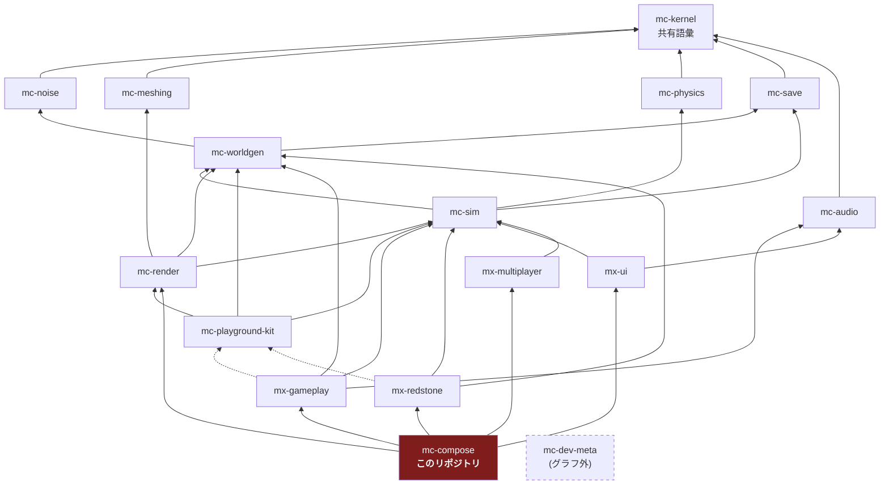

# アーキテクチャ

## 1. 4 階層アーキテクチャ

plan.md §2.2 の 4 階層。16 リポジトリはすべてこのいずれかに属する。

| 階層 | リポジトリ | 性質 |
| --- | --- | --- |
| 安定ライブラリ | mc-kernel / mc-noise / mc-meshing / mc-physics / mc-save / mc-audio | 純粋関数・狭い界面・変更頻度が低い。相互独立で並行構築可能 |
| 基盤 | mc-worldgen / mc-sim / mc-render / mc-playground-kit | 状態とサービス(**名詞**)。体験モジュールが乗る土台 |
| 体験モジュール | mx-gameplay / mx-redstone / mx-ui / mx-multiplayer | ルールと UI(**動詞**)。互いを知らず、基盤サービス経由でのみ会話する |
| 合成 | **mc-compose** | Layer マージ + stage 順序表 + E2E。**ロジックを持たない** |
| (グラフ外) | mc-dev-meta | 開発時ワークスペース束ね役。ゲームグラフには参加しない |

**mc-compose は第 4 階層(合成)であり、グラフの頂点である。**

## 2. 依存グラフ(16 リポジトリ全体)

実線 = 実行時依存(`dependencies`)、点線 = プレビュー起動時のみ(`devDependencies`)。
`mc-kernel` はどこからでも import 可能なため、エッジとしては描かない。



> **mc-kernel は全リポジトリから import 可能。** グラフに描かないのは、
> 全ノードから kernel へエッジを引くと図が読めなくなるためである。
> 本リポジトリでは direct import を `package.json` に宣言する。

## 3. このリポジトリの位置

mc-compose の direct runtime dependencies は `package.json` に宣言されている。
ホストは `mc-kernel` / `mc-sim` / `mc-worldgen` / `mc-render` と
`mx-gameplay` / `mx-redstone` / `mx-ui` / `mx-multiplayer` の公開 API を直接利用する。
この文書のグラフは、すべての import 文を列挙する whitelist ではなく、公開契約の所有と
ランタイムのデータフローを示す図である。

**推移的には全リポジトリに到達する。低レベル実装を compose から直接参照しない境界は、
`.oxlintrc.json` の `no-restricted-imports` で機械的に守る。**

```
mc-compose -> mx-gameplay -> mc-sim -> mc-physics -> ...
                                    -> mc-save
                                    -> mc-worldgen -> mc-noise
```

`pnpm install` すると依存パッケージは `node_modules` に配置されるが、
低レベルの `mc-noise` / `mc-meshing` / `mc-physics` は **import 禁止**である。
`pnpm lint` が `no-restricted-imports` の違反を非ゼロ終了で報告する。

依存の宣言と実際の import の一致、および低レベル実装への境界を分担して検査する詳細は
[responsibility.md](./responsibility.md) §3 に記載する。

## 4. 設計ルール

### 4.1 基盤 = 名詞、体験 = 動詞(plan.md §2.3-1)

| | 置き場 | 例 |
| --- | --- | --- |
| **名詞**(状態の置き場・サービス) | 基盤(mc-sim / mc-worldgen / mc-render) | `InventoryService`、`EntityManager`、`ChunkManager` |
| **動詞**(ルール・振る舞い) | 体験モジュール(mx-*) | 「掘ったらドロップする」「回路に電力が伝わる」 |

体験モジュール間の依存エッジは**ゼロ**である。
「採掘 → インベントリに入る」は mx-gameplay → mx-ui の呼び出しではなく、
mc-sim の `InventoryService` を経由して実現する。

**mc-compose にとってこれは「名詞も動詞も持たない」を意味する。**
compose が持つのは、名詞と動詞をどう束ねるかという**配線**だけである。
配線に見えないものが入ってきたら、それは名詞か動詞であり、上の 2 階層のどちらかに属する。

依存の直接性は `package.json` と型検査で確認し、低レベル import の禁止は
`.oxlintrc.json` と `pnpm lint` で確認する。

### 4.2 mc-playground-kit は production bootstrap の runtime dependency

`apps/web/main.ts` は browser bootstrap のために `mc-playground-kit` の
`makeBrowserPreview` を直接利用する。この呼び出しは production web host の起動経路にあるため、
パッケージは `package.json` の `dependencies` に明示する。

入力サービスの契約を所有するのは引き続き `mc-render` であり、kit がゲームルールや入力 API を
置き換えるわけではない。kit はブラウザの bootstrap/lifecycle glue を提供し、compose は公開された
サービスと stage を直接配線する。

### 4.3 stage 実行順序表は compose が唯一所有(plan.md §2.3-3)

**このリポジトリの中心。** [responsibility.md](./responsibility.md) §1.1 と
[public-api.md](./public-api.md) §1 を参照。

順序表(`STANDARD_STAGE_SKELETON`)は **14 個のフェーズの列**である。
stage id のリストではない。フェーズは「フレーム内の位置」と「そこに入る仕事の種類」を名指し、
stage id は自分の**名前部分**(最後の `:` より後ろ)でそこへの所属を宣言する
(`members` の要素が `:` で終わるときだけ、名前空間まるごとが一致する)。

**★ の 2 つは plan.md §4.2 に無い。** §4.2 の骨格はネットワークについて一言も述べていないので、
この 2 フェーズは §4.2 の転記ではなく**拡張**である。理由は §4.5 に書いた。

```
フェーズ                     ← 所属を宣言する実 id
input                        ← render:input
network:inbound          ★   ← multiplayer:inbound
simulation:physics           ← sim:physics
simulation:interactions      ← gameplay:interactions
simulation:entities          ← gameplay:entities
simulation:fluids            ← gameplay:fluids
simulation:redstone          ← redstone:power, redstone:effects   （名前空間一致）
simulation:time-weather      ← gameplay:time-weather
network:outbound         ★   ← multiplayer:outbound
camera-mirror                ← render:camera-mirror
chunk-sync                   ← render:chunk-sync
post-fx                      ← render:post-fx
render                       ← render:draw
hud-sync                     ← ui:hud-sync, ui:overlay-sync       （名前空間一致）
```

右の列は**例ではなく、6 リポジトリが実際に登録している 16 本**である
(`test/e2e/roster.ts`、`pnpm check:roster` が兄弟のソースと 1 行ずつ照合する)。
**空のフェーズは 1 つも無い。** かつて `simulation:physics` だけが空で、それは
「4 リポジトリが `after` で名指ししている stage を誰も登録していない」という欠陥の姿だった
(DN-14)。mc-sim が `sim:physics` を登録して埋まった。

**この形が §2.3-3 の実装そのものである。** 名前空間は「誰が所有するか」しか言わず、
名前は「どんな仕事か」しか言わない。モジュールが絶対位置を名乗る手段は増えていない。
compose がフェーズを並べ、モジュールは自分の `after` で**フェーズ内の**自分の位置だけを言う。

以前この表は具体的な stage id の平坦なリストで、**誰もその id を登録していなかった**ため
1 本もエッジを出しておらず、フレームは辞書順に退化していた。
経緯と回帰テストは [design-notes.md](./design-notes.md) DN-4.1。

### 4.4 依存境界は manifest と lint で強制

`package.json` が runtime direct dependency を宣言し、`.oxlintrc.json` の
`no-restricted-imports` が `mc-noise` / `mc-meshing` / `mc-physics` への直接 import を拒否する。
`pnpm lint` は違反時に非ゼロ終了する。以前の `check-dependency-whitelist.ts` と
`pnpm check:deps` は現行の enforcement ではないため、現在のゲートとして扱わない。

### 4.5 骨格に `network:inbound` / `network:outbound` を足した(§4.2 の拡張)

**これは plan.md §4.2 の読み取りではなく、§4.2 への追加である。**
§4.2 の骨格は input → simulation → camera-mirror → chunk-sync → post-fx → render → hud-sync で、
**ネットワークについて一言も述べていない**。フェーズも、名前空間も、
ネットワーク stage が名乗りそうな名前も無い。
だから「どこに置くか」ではなく「置くかどうか」から議論が要る。

#### 4.5-1 なぜ延期できなかったか

mx-multiplayer が `multiplayer:inbound` と `multiplayer:outbound` を登録した
(`stages/registration.ts:188` / `:234`)。この 2 本は、**この 2 フェーズを足す前の実測で
インデックス 14 と 15**、つまり `ui:overlay-sync` の**後ろ**に落ちた。
どのフェーズにも一致しない stage に `priorityOf` は `MAX_SAFE_INTEGER` を返すからである。
症状は「リモートの状態が毎フレーム 1 フレーム遅れて適用される」「ローカル位置が
レンダラの描画後に送信される」で、**どちらもクラッシュしないしラグにしか見えない**。

決め手は、**何もしないことが中立ではない**という点にある。
この表に「未配置」という状態は無い。骨格が拾わない stage は保留されるのではなく**最後に走る**。
mx-multiplayer のトランスポートの完成を待つことは、フレームを未決のまま置くことではなく、
**その間ずっと誤った答えを出荷すること**である。

「stage はあるがソケットはまだ無いリポジトリのためにフェーズを足すのは早すぎないか」
という反論は、この非対称性で退けられる。加えて、フレーム位置が依存するのは id と `after` だけであり、
mx-multiplayer は `stages/stage-ids.ts` でそれらを**確定済み**と明言している
(FIRST CUT なのは `run` の中身、すなわち seam と `TransportPort` の実装である)。

早すぎた場合のコストは実測してある: **mx-multiplayer を含まないビルドでは 2 フェーズとも空になり、
空のフェーズは鎖を切らずに閉じる**ので、シングルプレイ / ヘッドレスのフレームは
このフェーズが無かった頃と 1 本も変わらない
(回帰テスト `costs a build without mx-multiplayer nothing at all`)。

#### 4.5-2 なぜ 2 つで、なぜ `multiplayer:` 名前空間フェーズ 1 つではないのか

mx-multiplayer 自身が「1 つでは両方を同じ位置に拾ってしまう」と書いているが、
**実測はそれより強い結論を出した。単一の名前空間フェーズには、置ける位置が 1 つも無い。**

| 名前空間フェーズの位置 | 結果 |
| --- | --- |
| `simulation:physics` より前 | **合成が失敗する**。骨格の鎖が `multiplayer:outbound -> sim:physics` を足す一方、`multiplayer:outbound` は `after: [sim:physics]` を宣言しているので**循環**になる |
| `simulation:physics` より後 | 解決はするが `multiplayer:inbound` がシミュレーションの後ろに落ちる = 1 フレーム遅れ |

つまり分割は好みの問題ではない。回帰テスト
`has no position at all as a single `multiplayer:` namespace phase` が両方を固定している。

`members` が名前部分(`inbound` / `outbound`)で名前空間(`multiplayer:`)ではないのは、
この表の一貫した規則でもある — **名前空間は「誰が所有するか」、名前は「どんな仕事か」**しか言わない。
この 2 フェーズは mx-multiplayer のためではなく**ネットワーク I/O という仕事のため**に名付けてある。

#### 4.5-3 位置の理由

- **`inbound` は `input` と `simulation:physics` の間。**
  リモートの状態は、世界がシミュレートされる前に世界に入っていなければならない。
  これは `input` がローカルの意図について主張しているのと同じ因果の主張を、ソケットの向こう側に向けたものである。
  そして**この位置は mx-multiplayer からは宣言できない**: 要求は「`sim:physics` より前」であり、
  `StageRegistration` に `before` は無い。`after: [render:input]` への反転は §2.3-3 が compose に留保する
  グローバル順序の主張であり、入力 stage を登録しないヘッドレスビルドでは偽になる。

  **強制されている部分とそうでない部分を区別しておく**: 「physics より前」は強制。
  「`input` の *後*」は強制ではない — 両者は外界のサンプリングであり、触る状態は交わらない
  (ローカル入力エッジ vs 受信キュー)ので、index 0 に置いても宣言に反しない。
  mx-multiplayer の要求(「`STAGE_PHASE_INPUT` と `STAGE_PHASE_SIM_PHYSICS` の間」)の
  狭い方の読みを採った。

- **`outbound` は `simulation:time-weather` と `camera-mirror` の間。**
  送る値が確定するのはここであり、これ以降はすべてローカルな提示
  (カメラのミラー、メッシュ、描画、ポストエフェクト、DOM)で、権威ある状態を 1 つも変えない。
  そして `render` / `post-fx` はフレーム最大のコストなので、その後ろで送ると
  **既に確定していた値の送信レイテンシにフレームの最悪コストを上乗せする**ことになる。
  スケジューリング由来のレイテンシはリポジトリの中からは見えず、プレイヤーには回線の遅さに見える。

  なお `multiplayer:outbound` の `after: [sim:physics]` は「physics より後」しか言わないので、
  フレーム末尾でもその宣言は満たされる。**シミュレーションの末尾に固定しているのはこの表であり、
  mx-multiplayer ではない** — §2.3-3 の分担そのものである。

#### 4.5-4 未確認

plan.md はこのマシン上のどのチェックアウトにも存在しない。
したがって「§4.2 はネットワークに触れていない」は、**このリポジトリが持つ §4.2 の転記**
(`domain/stage-skeleton.ts` のうち §4.2 由来の 12 フェーズ、および本節の表)に対して確認したものであり、
plan.md 本文に対してではない。§4.2 が実はネットワークについて何か述べているなら、
本節はそれに合わせて書き直す必要がある。

## 5. 解決済み: mc-render は mc-compose から到達する

**この節の前半は、公開依存へ移行する前の設計記録である。** かつてロスターの中で `mc-render` を
実行時依存として宣言しているリポジトリが 1 つも無く、結果として **mc-render は mc-compose から
推移的にすら到達できなかった**。`mc-render` を import しようとすると `transitive-import` ですらなく
`not-whitelisted` になる、という状態である。

考えられる解決は 3 つ挙げてあり、「決定は plan.md §2.1 の所有者が行う」として保留していた:

1. `mx-ui -> mc-render` を足す(HUD がレンダラのキャンバスに乗る、という理解)
2. `mc-compose -> mc-render` を足す(compose が描画 stage を配線する、という理解)
3. 描画 stage を提供する新しい体験モジュールを置く

**縦切りスパイクが 2 を選んだ。**

### 5-1. なぜ 3 ではなく 2 なのか

描画 stage の完全な import 集合は `mc-kernel` + `mc-sim`(読み取りのみ) + `mc-render` + `mc-meshing` で、
これは**既に mc-render の行そのもの**である。3 を選ぶと、同じ行を持つノードを新設し、
さらに `新モジュール -> mc-render` のエッジを足し、plan.md §2.1 にノードを 1 つ増やすことになる。

そして描画 stage には**ゲームルールが 1 つも無い**。体験モジュール(plan.md §2.2)が所有するのは
VERB であり、これらを抱えたモジュールは VERB を 1 つも所有しない。名前だけの体験モジュールになる。

### 5-2. 当時の決定理由: 設計の対称性ではなく、実在する欠陥だった

> 以下は `mc-playground-kit` が開発時専用とされていた時点の記録である。
> 現在の kit は production browser bootstrap が利用する runtime dependency であり、
> `package.json` に明示されている。現在の依存境界は §3 と §4.4 を参照する。

`InputService.endFrame`(`mc-render/application/input-service.ts`)はフレーム毎にちょうど 1 回
呼ばれなければならない。**フレーム毎にちょうど 1 回起きるものは、定義上 stage である。**

ところが当時のロスター全体で登録されていた入力 stage は `mc-playground-kit` の `input:sample` **だけ**であり、
kit は開発時専用で `dependencies` に置くことを rule 6 が禁じていた。
つまり**出荷ビルドには入力 stage が存在しなかった**。`justPressed` が永久にクリアされず、
インベントリキーを 1 回押すと押しっぱなしのフレーム全部で再発火する。

これは当時の plan.md §2.3-2(「ランタイム入力は mc-render に置く。kit は開発時専用だから」)が
防ぐために書かれた失敗そのもので、サービスの置き場所ではなく **stage の欠落**として再発していた。

対応は `mc-render/stages/` である。詳細は mc-render `stages/stage-ids.ts` を参照。

### 5-3. なぜこれが prime directive を弱めないのか

**他モジュールの stage を登録するのは配線であって、ルールではない。**
compose は mc-render の `GameModule` を受け取り、その Layer を merge し、その `StageRegistration` を
リゾルバに渡す。mx-gameplay に対してやっている 3 つとまったく同じで、
どのモジュールが何を描くかについては何も知らない。

そして現在も低レベル実装への境界は効き続ける。`mc-noise` / `mc-meshing` / `mc-physics` は
公開パッケージの背後にあっても compose から直接 import できず、`.oxlintrc.json` の
`no-restricted-imports` と `pnpm lint` がこれを検査する。

当時の回帰テストは次の性質を固定していた:

- `reaches mc-render, because compose registers the renderer's stages`
- `still cannot reach mc-meshing, now as a closure violation rather than a flat one`

旧テスト `cannot reach mc-render or mc-meshing at all` は**削除ではなく反転**した。
なお、テストファイル自体は現行ツリーにはなく、現在の低レベル境界は §4.4 の lint ゲートで守る。
