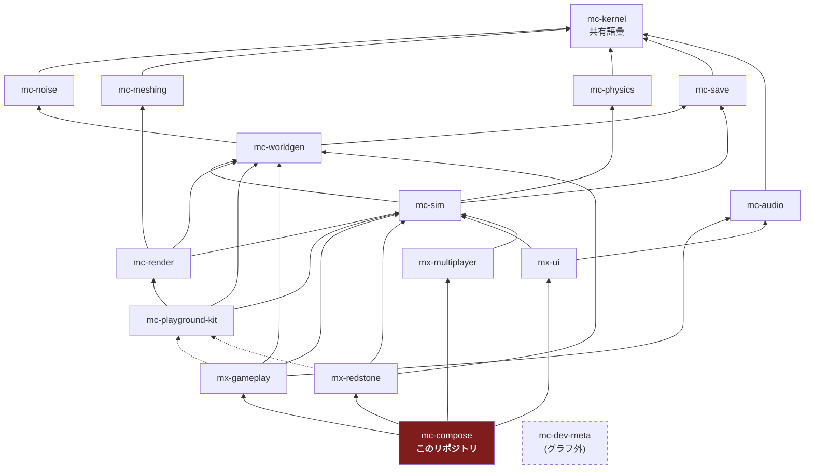

# アーキテクチャ

## 1. 4 階層アーキテクチャ

plan.md §2.2 の 4 階層。16 リポジトリはすべてこのいずれかに属する。

| 階層 | リポジトリ | 性質 |
| --- | --- | --- |
| 安定ライブラリ | mc-kernel / mc-noise / mc-meshing / mc-physics / mc-save / mc-audio | 純粋関数・狭い界面・変更頻度が低い。相互独立で並行構築可能 |
| 基盤 | mc-worldgen / mc-sim / mc-render / mc-playground-kit | 状態とサービス(**名詞**)。体験モジュールが乗る土台 |
| 体験モジュール | mx-gameplay / mx-redstone / mx-ui / mx-multiplayer | ルールと UI(**動詞**)。互いを知らず、基盤サービス経由でのみ会話する |
| 合成 | **mc-compose** | Layer マージ + stage 順序表 + E2E。**ロジックを持たない** |
| (グラフ外) | mc-dev-meta | 開発時ワークスペース束ね役。ゲームグラフには参加しない |

**mc-compose は第 4 階層(合成)であり、グラフの頂点である。**

## 2. 依存グラフ(16 リポジトリ全体)

実線 = 実行時依存(`dependencies`)、点線 = プレビュー起動時のみ(`devDependencies`)。
`mc-kernel` はどこからでも import 可能なため、エッジとしては描かない。



> **mc-kernel は全リポジトリから import 可能。** グラフに描かないのは、
> 全ノードから kernel へエッジを引くと図が読めなくなるためと、
> `scripts/check-dependency-whitelist.ts` が `dependencyGraph` に kernel を書くことを
> 設定エラーとして拒否するため(rule 4)。ただし `package.json` への記載は必要。

## 3. このリポジトリの位置

mc-compose の直接依存は **4 つの体験モジュールだけ** である:
mx-gameplay / mx-redstone / mx-ui / mx-multiplayer。

**推移的には全リポジトリに到達する。だからこそ「推移閉包の禁止」がここで最も重要になる。**

```
mc-compose -> mx-gameplay -> mc-sim -> mc-physics -> ...
                                    -> mc-save
                                    -> mc-worldgen -> mc-noise
```

`pnpm install` すると `node_modules` にはこれら全部が物理的に置かれるが、
**import は禁止**である。`pnpm check:deps` が `transitive-import` として非ゼロ終了する。

これは規範の機械化された半分である。詳細は [responsibility.md](./responsibility.md) §3。

## 4. 設計ルール

### 4.1 基盤 = 名詞、体験 = 動詞(plan.md §2.3-1)

| | 置き場 | 例 |
| --- | --- | --- |
| **名詞**(状態の置き場・サービス) | 基盤(mc-sim / mc-worldgen / mc-render) | `InventoryService`、`EntityManager`、`ChunkManager` |
| **動詞**(ルール・振る舞い) | 体験モジュール(mx-*) | 「掘ったらドロップする」「回路に電力が伝わる」 |

体験モジュール間の依存エッジは**ゼロ**である。
「採掘 → インベントリに入る」は mx-gameplay → mx-ui の呼び出しではなく、
mc-sim の `InventoryService` を経由して実現する。

**mc-compose にとってこれは「名詞も動詞も持たない」を意味する。**
compose が持つのは、名詞と動詞をどう束ねるかという**配線**だけである。
配線に見えないものが入ってきたら、それは名詞か動詞であり、上の 2 階層のどちらかに属する。

回帰テスト: `test/check-dependency-whitelist.test.ts` の
`records no edge between any two experience modules`。

### 4.2 mc-playground-kit は devDependency 専用(plan.md §2.3-2)

`mc-playground-kit` は「ミニ平地ワールド + カメラ + レンダラ + 入力を 1 秒で束ねる糊」であり、
**プレビュー(dev アプリ)からのみ使う**。

`dependencies` に入れてはならない理由は具体的である:
**実行時入力サービスの所有者は mc-render であり、kit ではない**(plan.md §2.3-2)。
kit を実行時依存にすると、出荷ビルドが「同梱されないハーネス」から入力を取ることになり、
リリースビルドから入力処理が丸ごと消える。

強制は 2 段構え:

1. `scripts/check-dependency-whitelist.ts` の `DEV_ONLY_PACKAGES` が
   `dependencies` への出現を `dev-only-package-in-dependencies` として拒否
2. 出荷ソース(`index.ts` / `domain/`)からの import を
   `dev-only-package-in-shipped-source` として拒否

**mc-compose は kit を devDependency としても使わない。** compose の検証は E2E であり、
kit のミニ世界ではなく本物の合成済みゲームを対象とするためである。

回帰テスト: `never names mc-playground-kit as a runtime edge`。

### 4.3 stage 実行順序表は compose が唯一所有(plan.md §2.3-3)

**このリポジトリの中心。** [responsibility.md](./responsibility.md) §1.1 と
[public-api.md](./public-api.md) §1 を参照。

### 4.4 依存ホワイトリストは CI で強制(plan.md §2.3-5)

`pnpm check:deps` は違反があれば必ず非ゼロ終了する。
参照実装の `check-package-dag.ts` は警告を出して常に 0 で終了していた
— 落ちないゲートはドキュメントであってゲートではない。

## 5. 未解決: mc-render はどこから実行時に到達するのか

**宣言されたグラフには穴がある。** ロスターの中で `mc-render` を実行時依存として
宣言しているリポジトリは **1 つも無い**:

- `mc-playground-kit -> mc-render` は存在するが、kit は **devDependency 専用**であり
  実行時エッジを作らない
- mx-ui は `mc-sim` と `mc-audio` にしか依存しない(DOM だけで起動するため)
- mc-compose の直接依存は 4 つの mx-* だけ

結果として、**mc-render は mc-compose から推移的にすら到達できない**。
`mc-render` を import しようとすると `transitive-import` ですらなく
`not-whitelisted` になる。`mc-meshing`(mc-render の背後)も同様である。

これは plan.md §2.1 のグラフをそのまま符号化した結果であり、本リポジトリの実装ミスではない。
**そして、このリポジトリが勝手に import を足して解決してよい問題でもない。**

考えられる解決は 3 つあり、いずれもグラフの変更(= plan.md の更新)を伴う:

1. `mx-ui -> mc-render` を足す(HUD がレンダラのキャンバスに乗る、という理解)
2. `mc-compose -> mc-render` を足す(compose が描画 stage を配線する、という理解)
3. 描画 stage を提供する新しい体験モジュールを置く

**決定は plan.md §2.1 の所有者が行う。** それまでこの穴は
`test/check-dependency-whitelist.test.ts` の
`cannot reach mc-render or mc-meshing at all — no runtime edge in the roster leads there`
としてピン留めしてあり、グラフが変われば必ずこのテストが落ちる。
