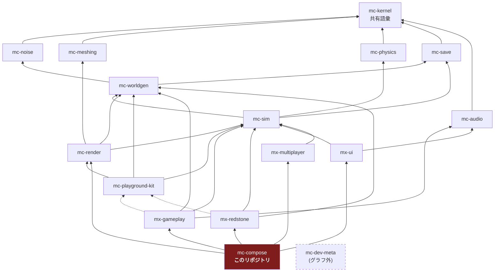

# アーキテクチャ

## 1. 4 階層アーキテクチャ

plan.md §2.2 の 4 階層。16 リポジトリはすべてこのいずれかに属する。

| 階層 | リポジトリ | 性質 |
| --- | --- | --- |
| 安定ライブラリ | mc-kernel / mc-noise / mc-meshing / mc-physics / mc-save / mc-audio | 純粋関数・狭い界面・変更頻度が低い。相互独立で並行構築可能 |
| 基盤 | mc-worldgen / mc-sim / mc-render / mc-playground-kit | 状態とサービス(**名詞**)。体験モジュールが乗る土台 |
| 体験モジュール | mx-gameplay / mx-redstone / mx-ui / mx-multiplayer | ルールと UI(**動詞**)。互いを知らず、基盤サービス経由でのみ会話する |
| 合成 | **mc-compose** | Layer マージ + stage 順序表 + E2E。**ロジックを持たない** |
| (グラフ外) | mc-dev-meta | 開発時ワークスペース束ね役。ゲームグラフには参加しない |

**mc-compose は第 4 階層(合成)であり、グラフの頂点である。**

## 2. 依存グラフ(16 リポジトリ全体)

実線 = 実行時依存(`dependencies`)、点線 = プレビュー起動時のみ(`devDependencies`)。
`mc-kernel` はどこからでも import 可能なため、エッジとしては描かない。



> **mc-kernel は全リポジトリから import 可能。** グラフに描かないのは、
> 全ノードから kernel へエッジを引くと図が読めなくなるためと、
> `scripts/check-dependency-whitelist.ts` が `dependencyGraph` に kernel を書くことを
> 設定エラーとして拒否するため(rule 4)。ただし `package.json` への記載は必要。

## 3. このリポジトリの位置

mc-compose の直接依存は **4 つの体験モジュール + mc-render** である:
mx-gameplay / mx-redstone / mx-ui / mx-multiplayer / mc-render。

mc-render のエッジは縦切りスパイクが足した唯一の tier 2 エッジで、根拠は §5 にある。
「他モジュールの stage を登録するのは配線であってルールではない」が理由であり、
その論法は mc-sim や mc-worldgen — 状態を持つもの — には一般化しない。

**推移的には全リポジトリに到達する。だからこそ「推移閉包の禁止」がここで最も重要になる。**

```
mc-compose -> mx-gameplay -> mc-sim -> mc-physics -> ...
                                    -> mc-save
                                    -> mc-worldgen -> mc-noise
```

`pnpm install` すると `node_modules` にはこれら全部が物理的に置かれるが、
**import は禁止**である。`pnpm check:deps` が `transitive-import` として非ゼロ終了する。

これは規範の機械化された半分である。詳細は [responsibility.md](./responsibility.md) §3。

## 4. 設計ルール

### 4.1 基盤 = 名詞、体験 = 動詞(plan.md §2.3-1)

| | 置き場 | 例 |
| --- | --- | --- |
| **名詞**(状態の置き場・サービス) | 基盤(mc-sim / mc-worldgen / mc-render) | `InventoryService`、`EntityManager`、`ChunkManager` |
| **動詞**(ルール・振る舞い) | 体験モジュール(mx-*) | 「掘ったらドロップする」「回路に電力が伝わる」 |

体験モジュール間の依存エッジは**ゼロ**である。
「採掘 → インベントリに入る」は mx-gameplay → mx-ui の呼び出しではなく、
mc-sim の `InventoryService` を経由して実現する。

**mc-compose にとってこれは「名詞も動詞も持たない」を意味する。**
compose が持つのは、名詞と動詞をどう束ねるかという**配線**だけである。
配線に見えないものが入ってきたら、それは名詞か動詞であり、上の 2 階層のどちらかに属する。

回帰テスト: `test/check-dependency-whitelist.test.ts` の
`records no edge between any two experience modules`。

### 4.2 mc-playground-kit は devDependency 専用(plan.md §2.3-2)

`mc-playground-kit` は「ミニ平地ワールド + カメラ + レンダラ + 入力を 1 秒で束ねる糊」であり、
**プレビュー(dev アプリ)からのみ使う**。

`dependencies` に入れてはならない理由は具体的である:
**実行時入力サービスの所有者は mc-render であり、kit ではない**(plan.md §2.3-2)。
kit を実行時依存にすると、出荷ビルドが「同梱されないハーネス」から入力を取ることになり、
リリースビルドから入力処理が丸ごと消える。

強制は 2 段構え:

1. `scripts/check-dependency-whitelist.ts` の `DEV_ONLY_PACKAGES` が
   `dependencies` への出現を `dev-only-package-in-dependencies` として拒否
2. 出荷ソース(`index.ts` / `domain/`)からの import を
   `dev-only-package-in-shipped-source` として拒否

**mc-compose は kit を devDependency としても使わない。** compose の検証は E2E であり、
kit のミニ世界ではなく本物の合成済みゲームを対象とするためである。

回帰テスト: `never names mc-playground-kit as a runtime edge`。

### 4.3 stage 実行順序表は compose が唯一所有(plan.md §2.3-3)

**このリポジトリの中心。** [responsibility.md](./responsibility.md) §1.1 と
[public-api.md](./public-api.md) §1 を参照。

順序表(`STANDARD_STAGE_SKELETON`)は **12 個のフェーズの列**である。
stage id のリストではない。フェーズは「フレーム内の位置」と「そこに入る仕事の種類」を名指し、
stage id は自分の**名前部分**(最後の `:` より後ろ)でそこへの所属を宣言する
(`members` の要素が `:` で終わるときだけ、名前空間まるごとが一致する)。

```
フェーズ                     ← 所属を宣言する id の例
input                        ← input
simulation:physics           ← sim:physics
simulation:interactions      ← gameplay:interactions
simulation:entities          ← gameplay:entities
simulation:fluids            ← gameplay:fluids
simulation:redstone          ← redstone:power, redstone:effects   （名前空間一致）
simulation:time-weather      ← gameplay:time-weather
camera-mirror                ← camera-mirror
chunk-sync                   ← chunk-sync
render                       ← render
post-fx                      ← post-fx
hud-sync                     ← ui:hud-sync, ui:overlay-sync       （名前空間一致）
```

**この形が §2.3-3 の実装そのものである。** 名前空間は「誰が所有するか」しか言わず、
名前は「どんな仕事か」しか言わない。モジュールが絶対位置を名乗る手段は増えていない。
compose がフェーズを並べ、モジュールは自分の `after` で**フェーズ内の**自分の位置だけを言う。

以前この表は具体的な stage id の平坦なリストで、**誰もその id を登録していなかった**ため
1 本もエッジを出しておらず、フレームは辞書順に退化していた。
経緯と回帰テストは [design-notes.md](./design-notes.md) DN-4.1。

### 4.4 依存ホワイトリストは CI で強制(plan.md §2.3-5)

`pnpm check:deps` は違反があれば必ず非ゼロ終了する。
参照実装の `check-package-dag.ts` は警告を出して常に 0 で終了していた
— 落ちないゲートはドキュメントであってゲートではない。

## 5. 解決済み: mc-render は mc-compose から到達する

**かつてここには「宣言されたグラフには穴がある」と書いてあった。** ロスターの中で `mc-render` を
実行時依存として宣言しているリポジトリが 1 つも無く、結果として **mc-render は mc-compose から
推移的にすら到達できなかった**。`mc-render` を import しようとすると `transitive-import` ですらなく
`not-whitelisted` になる、という状態である。

考えられる解決は 3 つ挙げてあり、「決定は plan.md §2.1 の所有者が行う」として保留していた:

1. `mx-ui -> mc-render` を足す(HUD がレンダラのキャンバスに乗る、という理解)
2. `mc-compose -> mc-render` を足す(compose が描画 stage を配線する、という理解)
3. 描画 stage を提供する新しい体験モジュールを置く

**縦切りスパイクが 2 を選んだ。**

### 5-1. なぜ 3 ではなく 2 なのか

描画 stage の完全な import 集合は `mc-kernel` + `mc-sim`(読み取りのみ) + `mc-render` + `mc-meshing` で、
これは**既に mc-render の行そのもの**である。3 を選ぶと、同じ行を持つノードを新設し、
さらに `新モジュール -> mc-render` のエッジを足し、plan.md §2.1 にノードを 1 つ増やすことになる。

そして描画 stage には**ゲームルールが 1 つも無い**。体験モジュール(plan.md §2.2)が所有するのは
VERB であり、これらを抱えたモジュールは VERB を 1 つも所有しない。名前だけの体験モジュールになる。

### 5-2. 決め手は設計の対称性ではなく、実在する欠陥だった

`InputService.endFrame`(`mc-render/application/input-service.ts`)はフレーム毎にちょうど 1 回
呼ばれなければならない。**フレーム毎にちょうど 1 回起きるものは、定義上 stage である。**

ところがロスター全体で登録されていた入力 stage は `mc-playground-kit` の `input:sample` **だけ**であり、
kit は開発時専用で `dependencies` に置くことを rule 6 が禁じている。
つまり**出荷ビルドには入力 stage が存在しなかった**。`justPressed` が永久にクリアされず、
インベントリキーを 1 回押すと押しっぱなしのフレーム全部で再発火する。

これは plan.md §2.3-2(「ランタイム入力は mc-render に置く。kit は開発時専用だから」)が
防ぐために書かれた失敗そのもので、サービスの置き場所ではなく **stage の欠落**として再発していた。

対応は `mc-render/stages/` である。詳細は mc-render `stages/stage-ids.ts` を参照。

### 5-3. なぜこれが prime directive を弱めないのか

**他モジュールの stage を登録するのは配線であって、ルールではない。**
compose は mc-render の `GameModule` を受け取り、その Layer を merge し、その `StageRegistration` を
リゾルバに渡す。mx-gameplay に対してやっている 3 つとまったく同じで、
どのモジュールが何を描くかについては何も知らない。

そして rule 3(推移閉包の禁止)は効き続ける。このエッジが許可するのは `mc-render` **だけ**であり、
その背後は許可しない。`mc-meshing` と `mc-sim` は推移的に到達可能になるので、
`not-whitelisted` ではなく `transitive-import` 違反になる — **メッセージが変わるだけで、
ハードエラーであることは変わらない**。

`test/check-dependency-whitelist.test.ts` の 2 本がこれを固定している:

- `reaches mc-render, because compose registers the renderer's stages`
- `still cannot reach mc-meshing, now as a closure violation rather than a flat one`

旧テスト `cannot reach mc-render or mc-meshing at all` は**削除ではなく反転**した。
片側(mc-meshing に到達できない)は今も守るべき性質だからである。
